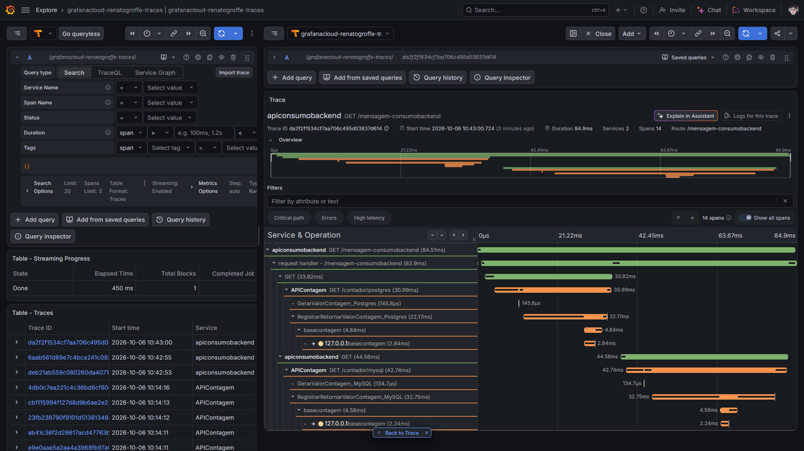
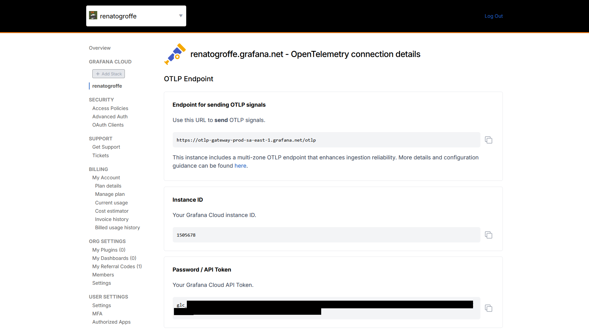

# nodejs-otel-grafanacloud-tempo_apiconsumobackend
Exemplo de API REST criada com o Node.js e utilizando OpenTelemetry + Grafana Cloud para tracing distribuído e consumindo 2 endpoints de uma API REST de contagem de acessos. Prova de conceito para uso com ambientes empregados em testes de observabilidade.

API REST consumida por este projeto: **https://github.com/renatogroffe/aspnetcore10-otel-grafanacloud-tempo-loki-postgres-mysql-testcontainers_contagemacessos**

## Testes

Trace gerado no Grafana Tempo:

Para integrar esta aplicação com o **Grafana Cloud** deve-se acessar a **opção OpenTelemetry**:

Acessar em **Password / API Token** a opção **Generate now**:

Criando assim um novo token (inserido no arquivo .env para este exemplo):

